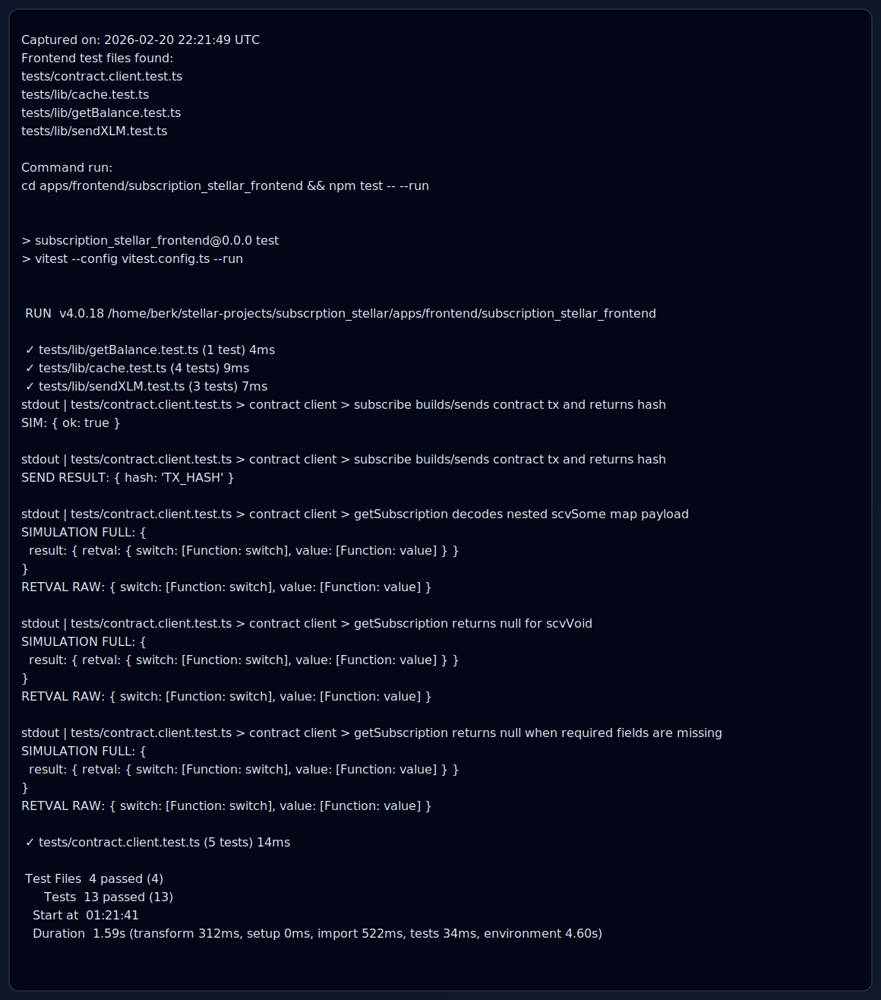

# Stellar Subscription Service

Monorepo for a Stellar testnet subscription app:
- Frontend: React + TypeScript + Vite
- Backend: Go API scaffold
- Contract package: Soroban subscription contract workspace

The frontend supports wallet connect, sending XLM, subscribing through a Soroban contract, balance/subscription reads, loading/progress feedback, and basic client-side caching for faster perceived response.

## Repository Structure

```text
.
├── apps
│   ├── backend                          # Go API
│   └── frontend
│       └── subscription_stellar_frontend
├── packages
│   ├── contracts
│   │   └── subscription                 # Soroban workspace
│   └── stellar                          # Shared Stellar Go packages
├── infra
└── Makefile
```

## Prerequisites

- Node.js 20+
- npm
- Go (matching project/toolchain constraints)
- A Stellar testnet wallet (Freighter or supported wallet through selector)

## Quick Start

1. Install frontend dependencies:
```bash
cd apps/frontend/subscription_stellar_frontend
npm install
```

2. Configure frontend environment:
```bash
cp .env.example .env
```
Set `VITE_CONTRACT_ID` to your deployed Soroban contract ID.

3. Run both apps from repo root:
```bash
make r
```

4. Open:
- Frontend: `http://localhost:5173`

## Makefile Commands (root)

- `make r` or `make run-all`: run backend + frontend
- `make rb`: run backend only
- `make rf`: run frontend only
- `make t`: run backend + frontend tests
- `make tb`: backend tests
- `make tf`: frontend tests
- `make c`: coverage commands
- `make cl`: cleanup

## Frontend Features

- Wallet connect/disconnect
- Send 1 XLM to self (test transaction path)
- Subscribe via Soroban contract call
- Read subscription state from contract
- Loading states and status messaging
- Subscription progress indicator (step + percentage)
- Basic local cache:
  - balances cache TTL: 30s
  - subscription cache TTL: 15s

## Frontend Test Coverage

Located in `apps/frontend/subscription_stellar_frontend/tests`:
- `tests/lib/getBalance.test.ts`
- `tests/lib/sendXLM.test.ts`
- `tests/contract.client.test.ts` (subscription contract client logic)
- `tests/lib/cache.test.ts` (TTL cache behavior)

Run directly:
```bash
cd apps/frontend/subscription_stellar_frontend
npm test -- --run
```

## Frontend Test Evidence Screenshot

This screenshot captures:
- discovered frontend test files
- the exact command used
- passing result summary (`4 passed` files, `13 passed` tests)



## Contract Package

Soroban contract workspace is under:
- `packages/contracts/subscription`

Core contract source:
- `packages/contracts/subscription/contracts/subscription/src/lib.rs`

## Notes

- This project targets Stellar testnet endpoints in current frontend code.
- Keep `VITE_CONTRACT_ID` aligned with the deployed contract on the same network.

## 1-Minute Demo Video

- Video URL: [Watch the 1-minute demo](https://www.loom.com/share/96419e34835643668225477a101b800e)

## License

MIT
