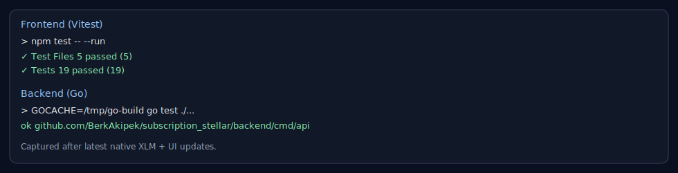

# Stellar Subscription Service

Production-oriented monorepo for a Stellar Testnet subscription application with native XLM settlement via Soroban contracts.

## Overview

- Frontend: React + TypeScript + Vite
- Backend: Go HTTP API
- Smart contracts: Soroban (Rust)
- Runtime target: Stellar Testnet

## Repository Layout

```text
.
├── apps
│   ├── backend
│   └── frontend/subscription_stellar_frontend
├── packages
│   ├── contracts/subscription
│   └── stellar
├── infra
│   ├── docker
│   └── env
└── Makefile
```

## Current Testnet Configuration

- Subscription contract: `CA2VD4N35RGAVDHCK4WXGZUJPS2NCFOT3BRPMCHFQ6SSQXVOFW3LLFFJ`
- Payment contract (native XLM SAC): `CDLZFC3SYJYDZT7K67VZ75HPJVIEUVNIXF47ZG2FB2RMQQVU2HHGCYSC`
- Payout/Treasury wallet: `GCEUZVV7XV3UPXKZKIMX2T3VZK6POIKMIOL3XM3XNZWXEK4CVVGNIWD2`

## Product Features

- Wallet connect/disconnect through selector/freighter providers.
- `Send 1 XLM` action to transfer from connected wallet to configured payout wallet.
- On-chain subscription with native XLM transfer from user to treasury wallet.
- Live subscription status read (`plan_id`, `expires_at`).
- Treasury wallet balance visibility in UI.
- Backend aggregated state endpoint (`/api/state`) including subscription, balance, and recent events.
- Mobile-responsive UI with sticky action controls on small screens.
- Local cache hydration for balances and subscription state.

## Subscription Parameters

- `plan_id`: `1`
- `duration_seconds`: `3600` (1 hour)
- `amount`: `10_000_000` stroops (`1 XLM`)

## Prerequisites

- Node.js 22+
- Go 1.25+
- Rust stable toolchain
- `stellar` CLI configured with a funded `deployer` identity for contract operations
- Docker (optional, for containerized run)

## Environment Configuration

### Frontend

Path: `apps/frontend/subscription_stellar_frontend/.env`

```env
VITE_SUBSCRIPTION_CONTRACT_ID=CA2VD4N35RGAVDHCK4WXGZUJPS2NCFOT3BRPMCHFQ6SSQXVOFW3LLFFJ
VITE_PAYMENT_CONTRACT_ID=CDLZFC3SYJYDZT7K67VZ75HPJVIEUVNIXF47ZG2FB2RMQQVU2HHGCYSC
VITE_PAYOUT_ADDRESS=GCEUZVV7XV3UPXKZKIMX2T3VZK6POIKMIOL3XM3XNZWXEK4CVVGNIWD2
VITE_BACKEND_URL=http://localhost:8080
```

### Backend

Path: `infra/docker/.env.backend` (Docker) or shell env vars (local run)

- `SUBSCRIPTION_CONTRACT_ID`
- `PAYMENT_CONTRACT_ID`
- `STELLAR_NETWORK` (default: `testnet`)
- `STELLAR_SOURCE` (optional; if empty, backend falls back to request user for read calls)

Reference: `infra/env/testnet.env.example`

## Quick Start (Local Development)

1. Install frontend dependencies:

```bash
cd apps/frontend/subscription_stellar_frontend
npm install
```

2. Create frontend environment file:

```bash
cp apps/frontend/subscription_stellar_frontend/.env.example apps/frontend/subscription_stellar_frontend/.env
```

3. Run backend and frontend together:

```bash
make r
```

4. Open:

- Frontend: `http://localhost:5173`
- Backend health: `http://localhost:8080/healthz`

## Docker Usage

Start stack:

```bash
make docker-up
```

Stop stack:

```bash
make docker-down
```

Useful operations:

- `make docker-logs`
- `make docker-ps`
- `make docker-env`

Production override:

```bash
make docker-prod-up
make docker-prod-down
```

## API Endpoints

- `GET /healthz` returns service health.
- `GET /api/state?user=<G...>` returns subscription, token/XLM balance in stroops, recent events, observed timestamp, network, and contract IDs.

## Make Commands

- `make r` or `make run-all`
- `make rb`
- `make rf`
- `make t`
- `make tb`
- `make tf`
- `make c`
- `make cl`

## Testing and Quality

Frontend:

```bash
cd apps/frontend/subscription_stellar_frontend
npm run lint
npm test -- --run
npm run build
```

Backend:

```bash
cd apps/backend
go test ./...
go vet ./...
```

Contracts:

```bash
cd packages/contracts/subscription
cargo fmt --all --check
cargo check --workspace
```

Test evidence screenshot:



## CI/CD (GitHub Actions)

Workflows live in `.github/workflows`.

CI (`ci.yml`):

- Trigger: pull requests and pushes to `main`.
- Backend checks: `gofmt`, `go vet`, `go test`.
- Frontend checks: `npm ci`, `npm test -- --run`, `npm run build`.
- Contracts checks: `cargo fmt --all --check`, `cargo check --workspace`.

CD (`cd.yml`):

- Trigger: pushes to `main`, pushes to tags matching `v*`, and manual dispatch.
- Builds and publishes container images to GHCR.
- Image: `ghcr.io/<owner>/subscription-stellar-backend`
- Image: `ghcr.io/<owner>/subscription-stellar-frontend`

Required GitHub settings:

- `Settings -> Actions -> General -> Workflow permissions`: `Read and write permissions`
- `Settings -> Secrets and variables -> Actions -> Variables`: add `VITE_SUBSCRIPTION_CONTRACT_ID`, `VITE_PAYMENT_CONTRACT_ID`, and optional `VITE_BACKEND_URL` (default `/api`).

## Contracts

- Workspace: `packages/contracts/subscription`
- Subscription contract source: `packages/contracts/subscription/contracts/subscription/src/lib.rs`

Key contract behavior:

- `init(admin, token_contract, treasury)` stores immutable runtime config.
- `subscribe(user, plan_id, duration_seconds, amount)` transfers `amount` from `user` to `treasury`.

## Demo

- Video: [Watch the 1-minute demo](https://www.loom.com/share/96419e34835643668225477a101b800e)

## License

MIT
